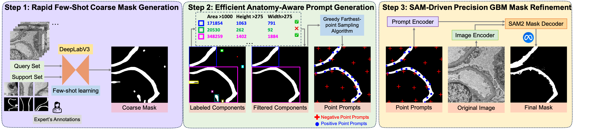

# CoFi: A Fast Coarse-to-Fine Few-Shot Pipeline for GBM Segmentation



> Official implementation of **CoFi**, our paper on glomerular basement membrane (GBM) segmentation using a lightweight few-shot model and SAM2-based refinement.  
> 🔬 Fast, accurate, and annotation-efficient segmentation for grayscale EM images.

## 🔍 Overview

CoFi is a fast and efficient coarse-to-fine segmentation pipeline designed for electron microscopy (EM) images of the glomerular basement membrane (GBM). It requires only **3 labeled support images**, and combines a lightweight DeepLabV3-based predictor with **automated, anatomy-aware prompt generation** and **SAM2 refinement**.

CoFi delivers:
- **Dice: 74.54%**
- **IoU: 61.87%**
- **Accuracy: 94.26%**
- **Speed: 1.9 FPS**

📄 [Paper on arXiv (coming soon)]

---

## 🧠 Key Features

- ⚡ **Fast few-shot training**: Trains on just 3 support images.
- 🩸 **Coarse-to-fine segmentation**: Uses DeepLabV3 for initial prediction.
- 🧬 **Anatomy-aware prompts**: Automatically extracts spatially diverse points based on GBM structure.
- 🎯 **SAM2 refinement**: Refines masks with Segment Anything Model 2 for subpixel accuracy.
- 🖥️ **Supports grayscale EM images**.

---

### 1. Installation
```bash
git clone https://github.com/ddrrnn123/CoFi.git
cd CoFi
pip install -r requirements.txt
