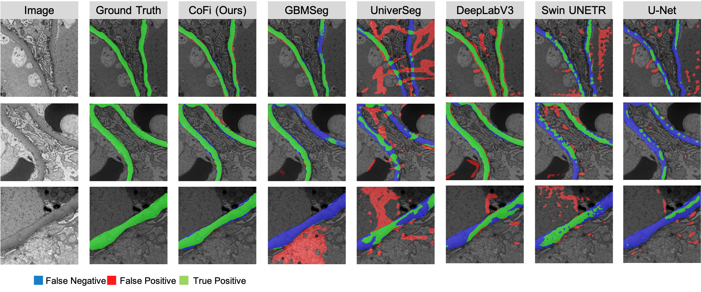

# CoFi: A Fast Coarse-to-Fine Few-Shot Pipeline for GBM Segmentation


> Official implementation of **CoFi**, our paper on glomerular basement membrane (GBM) segmentation using a lightweight few-shot model and SAM2-based refinement.  
> 🔬 Fast, accurate, and annotation-efficient segmentation for grayscale EM images.

## Abstract

Accurate segmentation of the glomerular basement membrane (GBM) in electron microscopy (EM) images is fundamental
for quantifying membrane thickness and supporting the diagnosis of various kidney diseases. While supervised deep
learning approaches achieve high segmentation accuracy, their reliance on extensive pixel-level annotation renders them
impractical for clinical workflows. Few-shot learning can reduce this annotation burden but often struggles to capture
the fine structural details necessary for GBM analysis. In this study, we introduce CoFi, a fast and efficient coarse-to-
fine few-shot segmentation pipeline designed for GBM delineation in EM images. CoFi first trains a lightweight neural
network using only three annotated images to produce an initial coarse segmentation mask. This mask is then automatically
processed to generate high-quality point prompts with morphology-aware pruning, which are subsequently used to guide
SAM in refining the segmentation. The proposed method achieved exceptional GBM segmentation performance, with a
Dice coefficient of 0.745 and an inference speed of 1.9 FPS. We demonstrate that CoFi not only alleviates the annotation
and computational burdens associated with conventional methods, but also achieves accurate and reliable segmentation
results. The pipeline’s speed and annotation efficiency make it well-suited for both research and clinical applications in
renal pathology

CoFi delivers:
- **Dice: 74.54%**
- **IoU: 61.87%**
- **Accuracy: 94.26%**
- **Speed: 1.9 FPS**

📄 [Paper on arXiv (coming soon)]

---

##  Key Features

-  **Fast few-shot training**: Trains on just 3 support images.
-  **Coarse-to-fine segmentation**: Uses DeepLabV3 for initial prediction.
-  **Anatomy-aware prompts**: Automatically extracts spatially diverse points based on GBM structure.
-  **SAM2 refinement**: Refines masks with Segment Anything Model 2 for subpixel accuracy.
-  **Supports grayscale EM images**.

---

##  Demo and Comparison to Other Models



---

### Installation
```bash
git clone https://github.com/ddrrnn123/CoFi.git
cd CoFi
pip install -r requirements.txt


